# kottans-frontend

## 0.Git intro

Дуже класна інтерактивна гра по Git з усім необхідними базовими командами. Відеокурс від гугл був непоганий.

## 1.Linux CLI, and HTTP

[Linux survival](https://linuxsurvival.com) дуже цікава платформа, де можна попрактикуватися в написанні команд та побачити наживо що вони роблять.

Screenshots

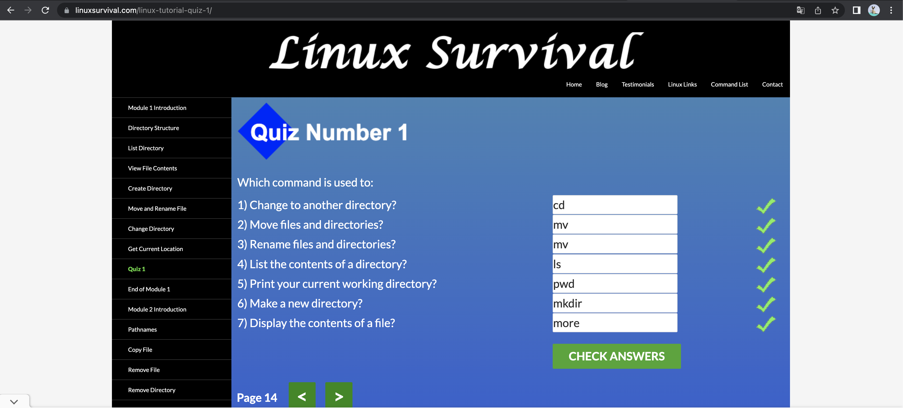
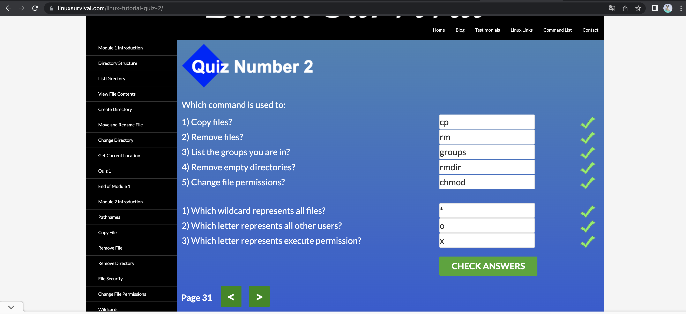
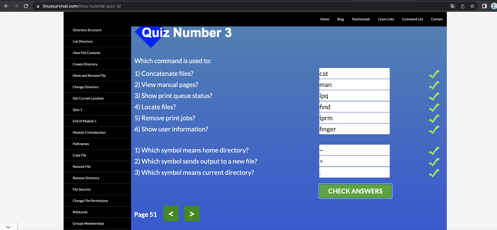
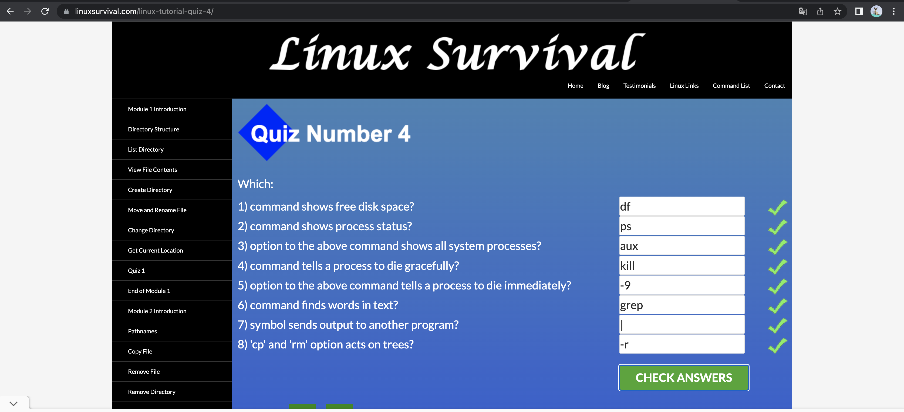

Інформація по HTTP/HTTPS протоколах цікава та викладена в доступній формі.

## 2.Git Collaboration

Інтерактивна гра https://learngitbranching.js.org/ допомогла розібратись глибше, як працює git.
Зʼясувала різницю між git fetch та git merge, які бувають види мерджів(fast-forward, three-way, etc).

Screenshots

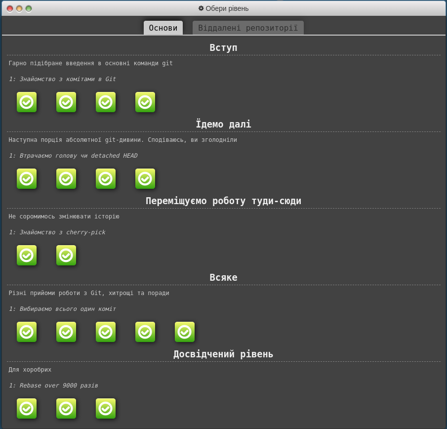
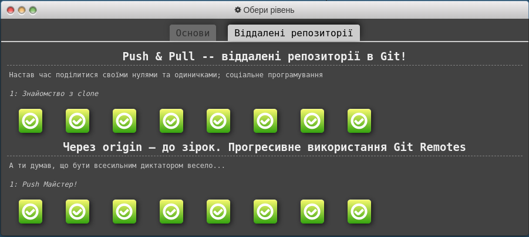

Лекції на Coursera були структоровані,але все ж таки практицні заняття дають більше результату.

## 3.Intro to HTML and CSS

Цей розділ підійде людям, які тільки починають вчити HTML та CSS.
Вже був досвід навчання на платформі codecademy. Подобається ця платформа(інші курси теж варто подивитись, якщо є час).

Screenshots

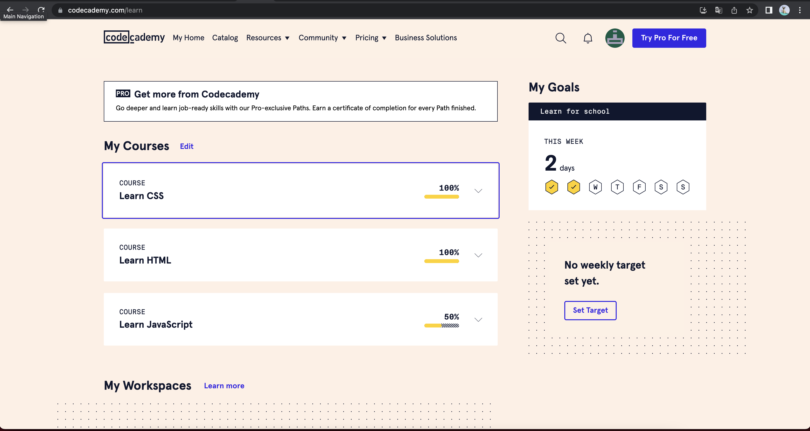

## 4.Responsive Web Design

Відеолекції були не новими для мене, передивилась та освіжила в памʼяті основні моменти. Активно використовую flex та grid в роботі та при створенні особистих PET-проектів.

Інтерактивні ігри теж колись проходила, але досі вважаю що це мега классні платформи для навчання з нуля.

Вважаю корисними ще дві сторніки(шпаргалки):
<a href="https://grid.malven.co/">grid</a>
 
<a href="https://flexbox.malven.co/">flex</a>

Screenshots

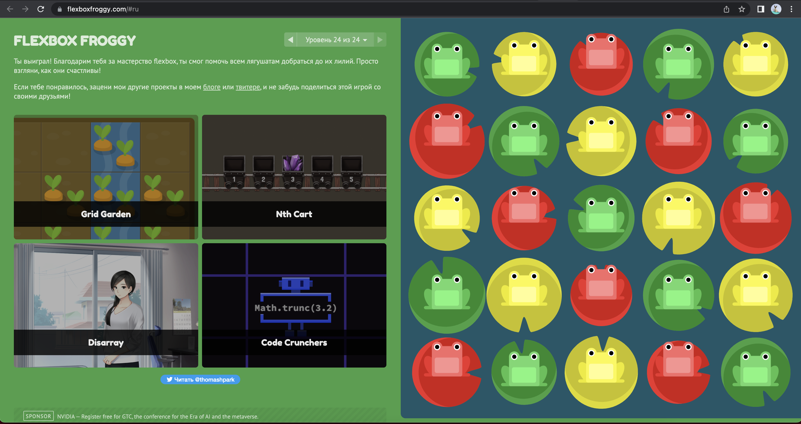
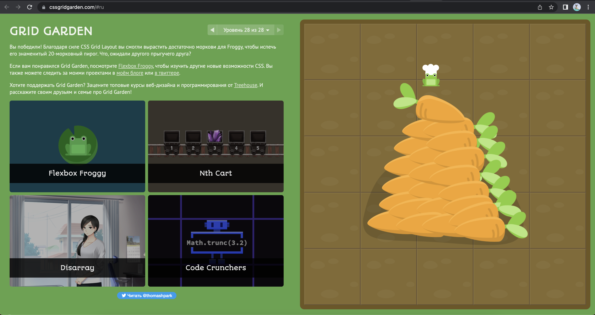

## 5.JavaScript Basics

Вправи на FreeCodeCamp були особливим челенджем для мене. Колись я вже починала проходити ці задачки, тому база вже є.
Останні вправи по алгоритмах винудили скористатися підказками від цього сервісу.
Треба більше практики і все буде добре *сподіваюсь*).
Вже з нетерпінням чекаю задач по створенню реального проекту та міні-ігор 🎮

Screenshots

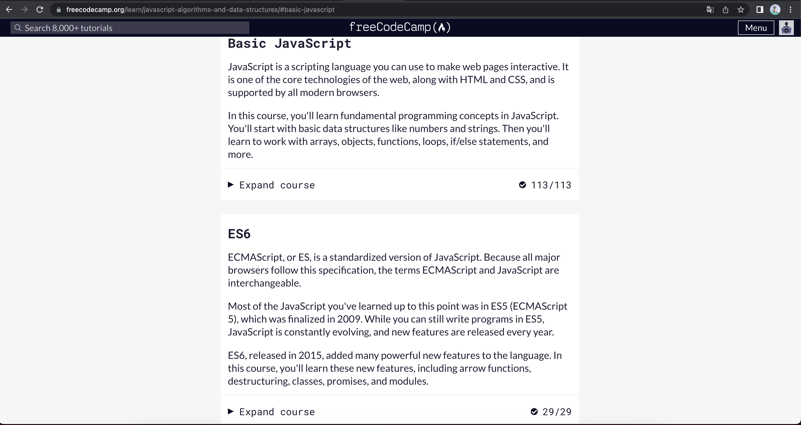
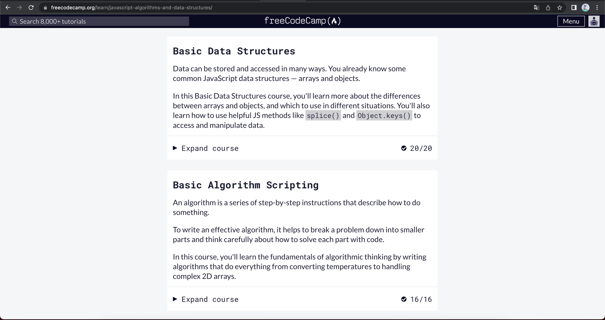
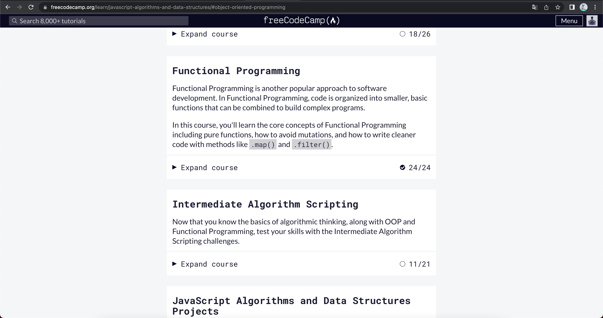

